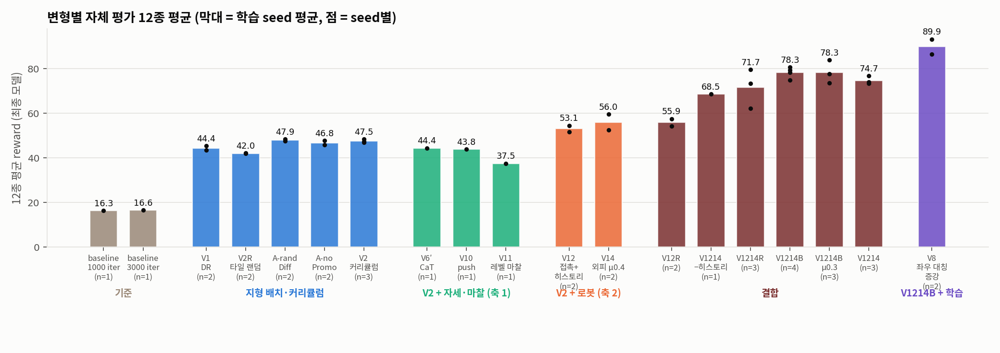

# 과제 1 — 처음 보는 지형에서도 걷는 Ant

Isaac-Ant-v0 (Isaac Lab 2.3.0, RSL-RL PPO) 정책을 지형 형태·지형 파라미터(마찰 등)가 바뀐 unseen 환경에서도 걷게 만드는 과제.
조교는 우리 태스크 설정으로 체크포인트를 로드하고 지형만 바꿔 평가하므로, **학습 환경 + 로봇(센서·물성) + 학습 방법**을 함께 설계했다.

- **최종 제출**: `checkpoints/final/model_2999.pt` (`v8_s44@2999`), 태스크 `Isaac-Ant-Team12-v0`, 평가 명령 [`eval_command.txt`](eval_command.txt)
- 발표 자료: LMS 제출본 참조 (레포에는 넣지 않음) · 발표 재료: [`docs/report_material.md`](docs/report_material.md) · 결과 표: [`results/summary_round2.md`](results/summary_round2.md)
- 작업 로그: [`docs/log_0929.md`](docs/log_0929.md) ~ [`docs/log_1006.md`](docs/log_1006.md) · 설계 메모: [`docs/01_improvement_plan_0930.md`](docs/01_improvement_plan_0930.md) · 평가 기준 리뷰: [`docs/03_review_new_criteria_1005.md`](docs/03_review_new_criteria_1005.md) · 영상 재녹화 패치: [`docs/04_video_recapture_patch.md`](docs/04_video_recapture_patch.md)

## 결과 요약

자체 unseen 평가 12종 평균 reward (원래 Isaac-Ant-v0 보상, eval seed 24·25 × 256 envs, 학습 seed 평균 ± 표준편차):

| baseline | V2 차선 커리큘럼 | V12 접촉+히스토리 | V14 외피 μ0.4 | V1214B 결합 | **V8 = V1214B + 좌우 대칭 증강** |
|---|---|---|---|---|---|
| 16.3 | 47.5 ± 0.6 | 53.1 | 56.0 | 78.3 ± 2.1 | **91.2 ± 2.8** |

- 제출 태스크 공식 조건 (평면, `play_one_episode --seed 24 --num_envs 100`): **174.73 ± 12.67** (baseline 134.90 ± 27.74)
- 대칭 ablation: 대칭 손실만 (V8-ML) 77.9 ± 1.1, 기본 로봇 + 증강 (V2Sym) 50.2 ± 2.7 → 이득은 거울 데이터 증강 × 로봇 변경의 상호작용
- **잠금 테스트 `UnseenMix`** (학습 범위 밖 블록·피라미드·경사 위 블록·원기둥·평지, 공식 조건 1회): baseline 9.51 ± 7.52 / V2 46.70 ± 30.17 / V1214B 100.19 ± 22.11 / **최종 V8 113.65 ± 29.03**

- 수치의 한계: 평가 지형 폭 32 m에서 빠른 정책 약 27%가 지형 밖으로 이탈(바깥 두 열이 가장자리 4 m에서 스폰) — 지형 안 로봇만 비교해도 순위 동일, [`docs/log_1005.md`](docs/log_1005.md)



## 설치

수업 기준 환경(conda `lerobot-arena`, Isaac Sim 5.1.0, `~/IsaacLab_RS` = Isaac Lab 2.3.0)이 설치되어 있다고 가정한다.

```bash
conda activate lerobot-arena
pip install -e assignment1_ant/source/ant_rough   # 태스크 등록 (한 번만)
```

## 최종 체크포인트 실행 (조교 평가 형식)

[`eval_command.txt`](eval_command.txt) 참고. 조교 평가 지형은 `source/ant_rough/ant_rough/tasks/submission_env_cfg.py`의 TERRAIN 블록만 바꾸면 된다.

```bash
cd ~/IsaacLab_RS
./isaaclab.sh -p <repo>/assignment1_ant/scripts/rsl_rl/play_one_episode.py \
    --task Isaac-Ant-Team12-v0 --seed 24 --num_envs 100 --headless \
    --checkpoint <repo>/assignment1_ant/checkpoints/final/model_2999.pt
```

`play_one_episode.py`는 수업 스크립트 복사본이며 `import ant_rough.tasks` 한 줄만 다르다.
네트워크: 관측 204 (Isaac-Ant-v0 60 + 발 접촉 8 = 68, × 3 step 히스토리) / 행동 8 / MLP [400, 200, 100] elu / 관측 정규화.

## 태스크

`source/ant_rough` (외부 확장 패키지, IsaacLab_RS는 수정하지 않음). 학습·평가 스크립트는 이 폴더의 `scripts/`에서 실행한다 (`import ant_rough.tasks`로 등록).

| 태스크 | 용도 |
|---|---|
| `Isaac-Ant-Rough-v0` | V1: 블록·노이즈·장애물·경사·평지 혼합 + 로봇 마찰 랜덤화 |
| `Isaac-Ant-Rough-Curriculum-v0` | **V2**: 난이도 차선 커리큘럼 (`LaneTerrainGenerator`) |
| `Isaac-Ant-Rough-Stable-v0` | V4: V1 + 수직·roll/pitch 속도 페널티 |
| `Isaac-Ant-Rough-V5-v0` | V5: V2 + 타일별 랜덤 지형 + 계단 + 넓은 마찰 |
| `Isaac-Ant-Rough-V12/V14/V1214/V1214B-v0` | 로봇 변경: 발 접촉 센서 + 관측 히스토리 3 + 정규화 (V12), 외피 재질 μ0.4 combine min (V14), 결합 |
| `Isaac-Ant-Rough-V8-v0` | **최종**: V1214B 환경 + PPO 좌우 대칭 데이터 증강 ([`symmetry.py`](source/ant_rough/ant_rough/tasks/symmetry.py), 검증 `scripts/check_symmetry.py`) |
| `Isaac-Ant-Rough-V8ML-v0`, `-V2Sym-v0` | 대칭 ablation: 손실만 / 기본 로봇 + 증강 |
| `Isaac-Ant-Deploy-<V>-v0` | 배포 설정 (학습 로봇 그대로 + Isaac-Ant-v0 평면) |
| `Isaac-Ant-Team12-v0` | **제출 태스크** (= Deploy-V1214, 평면 μ1.0) |
| `Isaac-Ant-Test-UnseenMix[-V1214]-v0` | 잠금 테스트 (마지막에 1회) |
| `Isaac-Ant-Eval-<Name>[-Team12]-v0` | 자체 unseen 평가 14종 (Isaac-Ant-v0에서 지형·지면 마찰만 교체), [`eval_names.py`](source/ant_rough/ant_rough/tasks/eval_names.py) |
| `Isaac-Ant-Eval-<Name>-Team12-Wide-v0` | 영상용 넓은 지형 (12열 96 m), `scripts/rsl_rl/play_one_episode_video.py --center_spawn`과 함께 사용 |
| `Isaac-Ant-Diag-Box{Prim,Mesh}[Flat]-v0` | 진단용: 같은 블록 배열의 박스 prim vs 삼각 메시 |

## 명령

모두 `assignment1_ant/`에서, `conda activate lerobot-arena` 상태로 실행. 학습 로그는 `logs/rsl_rl/ant_rough/` (gitignore).

```bash
# 학습 (V2 예)
~/IsaacLab_RS/isaaclab.sh -p scripts/rsl_rl/train.py --task Isaac-Ant-Rough-Curriculum-v0 --headless --seed 42 --run_name v2_curr_mix_s42

# 평가 세트 전체 (체크포인트 여러 개, CSV + 요약표)
python scripts/eval_suite.py --out results/eval.csv --ckpt v2=logs/rsl_rl/ant_rough/<run>/model_2999.pt

# held-out 체크포인트 선택 (선택용 Boxes·Rails → 보고용 SlopedGrid·Pyramids)
python scripts/select_checkpoint.py --out_prefix results/select_v2 --run v2_s44=logs/rsl_rl/ant_rough/<run> --iters 1500 2000 2500 2999

# 평지 낙상 진단 (H1 임계 / H2 wrench / H3 마찰×표면 / 박스 prim)
python scripts/diag_meshflat.py --out results/diag_meshflat.csv

# 그림
python scripts/plot_results.py --csv results/eval_full_*.csv --out docs/figures
cd scripts && python plot_diag.py --csv ../results/diag_meshflat.csv --out ../docs/figures

# 보고용 영상 (docs/media/, mp4는 gitignore)
bash scripts/capture_videos.sh
bash scripts/capture_videos.sh final_wide   # 최종 모델, 넓은 지형
```

## 폴더

```
assignment1_ant/
├── source/ant_rough/          외부 확장 패키지 (태스크·지형·평가·진단 환경)
├── scripts/                   rsl_rl/{train,play,play_one_episode}.py 복사본 + 평가·선택·진단·그림·영상 스크립트
├── checkpoints/
│   ├── final/                 **최종 제출** v8_s44@2999 (model_2999.pt, params/)
│   └── baseline_flat/         Isaac-Ant-v0 baseline (seed 42, model_999.pt)
├── results/                   평가·진단·선택 CSV
└── docs/                      로그, 코드 노트, 설계·리뷰 메모, 발표 자료, figures/, media/(영상 목록)
```
