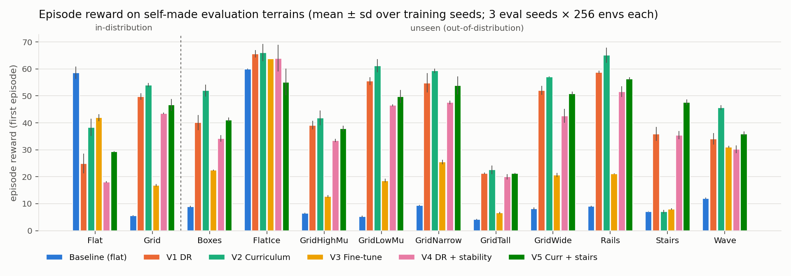

# 과제 1 — 처음 보는 지형에서도 걷는 Ant

Isaac-Ant-v0 (Isaac Lab 2.3.0, RSL-RL PPO) 정책을 지형 형태·지형 파라미터(마찰 등)가 바뀐 unseen 환경에서도 걷게 만드는 과제.
**정책 입출력 규격은 baseline과 동일하게 두고 학습 환경만 바꾼다** — 모든 체크포인트가 `--task Isaac-Ant-v0`로 그대로 로드된다.

- 중간 보고: [`docs/interim_report_1001.md`](docs/interim_report_1001.md)
- 작업 로그: [`docs/log_0929.md`](docs/log_0929.md), [`docs/log_0930.md`](docs/log_0930.md) · 코드 노트: [`docs/00_codebase_notes.md`](docs/00_codebase_notes.md)
- 상태 (2026.09.30): 제출 후보 `checkpoints/candidate_v2_s44/model_2999.pt`. 최종 제출본은 10.06까지 확정.

## 결과 요약

자체 unseen 평가 12종 평균 reward (3 eval seed × 256 envs, 원래 보상, 학습 seed 평균):

| baseline | V1 DR | **V2 커리큘럼** | V3 파인튜닝 | V4 안정성 페널티 | V5 |
|---|---|---|---|---|---|
| 16.2 | 44.3 | **47.5** | 24.1 | 38.9 | 43.8 |



## 설치

수업 기준 환경(conda `lerobot-arena`, Isaac Sim 5.1.0, `~/IsaacLab_RS` = Isaac Lab 2.3.0)이 설치되어 있다고 가정한다.

```bash
conda activate lerobot-arena
pip install -e assignment1_ant/source/ant_rough   # 태스크 등록 (한 번만)
```

## 제출 후보 체크포인트 실행 (수업 평가 명령 형식)

```bash
cd ~/IsaacLab_RS
./isaaclab.sh -p scripts/reinforcement_learning/rsl_rl/play_one_episode.py \
    --task Isaac-Ant-v0 --seed 24 --num_envs 16 \
    --checkpoint <repo>/assignment1_ant/checkpoints/candidate_v2_s44/model_2999.pt
```

수업 포크 원본 스크립트로 로드 확인 (2026.09.30): 기본 평면 16 envs reward **95.0 ± 3.9**, 16/16 완주.
네트워크 규격: 관측 60 / 행동 8 / actor·critic MLP [400, 200, 100] elu / 관측 정규화 없음 — `Isaac-Ant-v0`의 `AntPPORunnerCfg`와 state dict가 동일.

## 태스크

`source/ant_rough` (외부 확장 패키지, IsaacLab_RS는 수정하지 않음). 학습·평가 스크립트는 이 폴더의 `scripts/`에서 실행한다 (`import ant_rough.tasks`로 등록).

| 태스크 | 용도 |
|---|---|
| `Isaac-Ant-Rough-v0` | V1: 블록·노이즈·장애물·경사·평지 혼합 + 로봇 마찰 랜덤화 |
| `Isaac-Ant-Rough-Curriculum-v0` | **V2**: 난이도 차선 커리큘럼 (`LaneTerrainGenerator`) |
| `Isaac-Ant-Rough-Stable-v0` | V4: V1 + 수직·roll/pitch 속도 페널티 |
| `Isaac-Ant-Rough-V5-v0` | V5: V2 + 타일별 랜덤 지형 + 계단 + 넓은 마찰 |
| `Isaac-Ant-Eval-<Name>-v0` | 자체 unseen 평가 14종 (Isaac-Ant-v0에서 지형·지면 마찰만 교체), [`eval_names.py`](source/ant_rough/ant_rough/tasks/eval_names.py) |
| `Isaac-Ant-Diag-Box{Prim,Mesh}[Flat]-v0` | 진단용: 같은 블록 배열의 박스 prim vs 삼각 메시 |

## 명령

모두 `assignment1_ant/`에서, `conda activate lerobot-arena` 상태로 실행. 학습 로그는 `logs/rsl_rl/ant_rough/` (gitignore).

```bash
# 학습 (V2 예)
~/IsaacLab_RS/isaaclab.sh -p scripts/rsl_rl/train.py --task Isaac-Ant-Rough-Curriculum-v0 --headless --seed 42 --run_name v2_curr_mix_s42

# 평가 세트 전체 (체크포인트 여러 개, CSV + 요약표)
python scripts/eval_suite.py --out results/eval.csv --ckpt v2=logs/rsl_rl/ant_rough/<run>/model_2999.pt

# held-out 체크포인트 선택 (선택용 Boxes·Rails → 보고용 SlopedGrid·Pyramids)
python scripts/select_checkpoint.py --out_prefix results/select_v2 --run v2_s44=logs/rsl_rl/ant_rough/<run> --iters 1500 2000 2500 2999

# 평지 낙상 진단 (H1 임계 / H2 wrench / H3 마찰×표면 / 박스 prim)
python scripts/diag_meshflat.py --out results/diag_meshflat.csv

# 그림
python scripts/plot_results.py --csv results/eval_full_*.csv --out docs/figures
cd scripts && python plot_diag.py --csv ../results/diag_meshflat.csv --out ../docs/figures

# 보고용 영상 (docs/media/, mp4는 gitignore)
bash scripts/capture_videos.sh
```

## 폴더

```
assignment1_ant/
├── source/ant_rough/          외부 확장 패키지 (태스크·지형·평가·진단 환경)
├── scripts/                   rsl_rl/{train,play,play_one_episode}.py 복사본 + 평가·선택·진단·그림·영상 스크립트
├── checkpoints/
│   ├── baseline_flat/         Isaac-Ant-v0 baseline (seed 42, model_999.pt)
│   └── candidate_v2_s44/      제출 후보 V2 seed 44 (model_2999.pt, params/)
├── results/                   평가·진단·선택 CSV
└── docs/                      로그, 코드 노트, 계획서, 중간 보고, figures/, media/(영상 목록)
```

## 남은 일 (10.06 제출까지)

- 뒤집힘 대응 변형 (자세 CaT, 외란·초기 자세 랜덤화, 대칭성 증강) → 같은 선택 파이프라인으로 최종 체크포인트 확정
- `checkpoints/final/`, 제출용 평가 명령어 txt, 발표 자료
