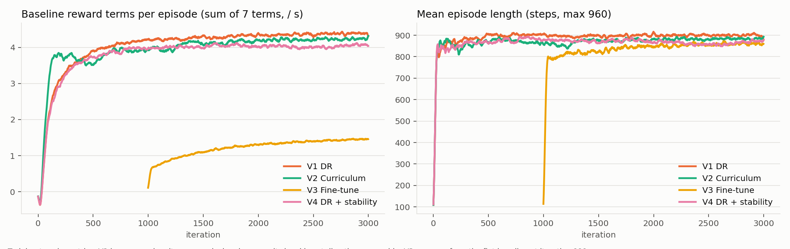
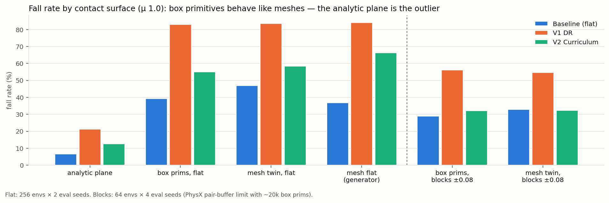
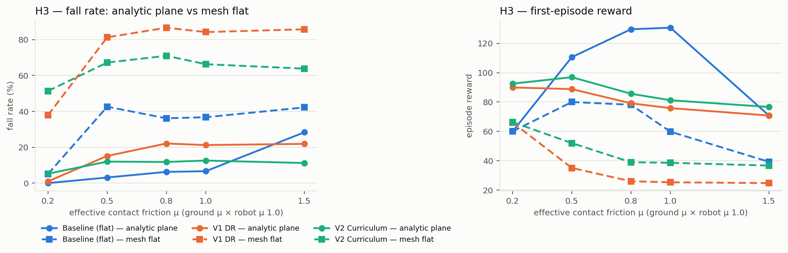
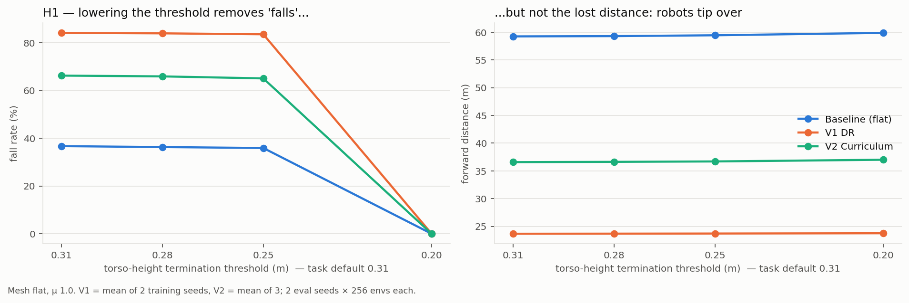

# 과제 1 중간 보고: 처음 보는 지형에서도 걷는 Ant

- 보고일: 2026.10.01 (목) · 작성 기준: 2026.09.30 실험까지 · 12조 박형근 개인 파이프라인
- 마감: 2026.10.06 (화) 23:59 제출 → 10.08 (목) 5분 발표
- 레포: `robotics-simulation-team12/assignment1_ant/` · 상세 로그 `docs/log_0929.md`, `docs/log_0930.md`
- 웹 버전 (그림·영상 포함): https://claude.ai/artifact/Lxat6SEEkaESjFSqQGxiUB

## 0. 요약

- Isaac-Ant-v0 정책을 **입출력 규격은 그대로 두고 학습 환경만 바꿔서** 지형 강건하게 만들었다.
- 자체 평가 지형 12종 평균 reward: baseline **16.2** → 현재 1위 V2(차선 커리큘럼) **47.5** (학습 seed 3개 모두 46.9~48.4).
- 가장 큰 남은 약점은 **평지에서 뒤집힘**이다. 진단해 보니 "메시 문제"가 아니라 Isaac-Ant-v0 기본 바닥(해석적 무한 평면)만 예외적으로 관대했고,
  박스 도형이든 메시든 평면이 아닌 표면에서는 마찰 μ≥0.5에서 뒤집힘이 급증한다.
- 제출 후보: `v2_s44@2999` (선택용 held-out으로 고름). 다음 단계는 뒤집힘을 겨냥한 변형 2~3개.

## 1. 문제와 제약

| 항목 | 내용 |
|---|---|
| 태스크 | Isaac-Ant-v0 (Isaac Lab 2.3.0, **manager-based**), RSL-RL PPO |
| 평가 | 조교가 우리 체크포인트를 자기 unseen 환경(지형 형태·지형 파라미터만 변경)에서 실행, 영상·reward 공개 |
| 지표(추정) | `play_one_episode.py`의 **첫 에피소드 누적 reward** (최대 960 step = 16 s) |
| 규격 제약 | `play.py`가 **평가 태스크의 설정**으로 네트워크를 만들고 `strict=True`로 로드 → 관측 60 / 행동 8 / MLP [400,200,100] elu / 관측 정규화 없음 / critic 대칭을 그대로 유지해야 조교 환경에서 로드됨 |
| 전략 | 지형·마찰 랜덤화, 커리큘럼, 학습 보상 등 **환경 쪽만 변경**. 모든 체크포인트는 `--task Isaac-Ant-v0`로 로드 가능 |

브리프 가설과 달랐던 점: Ant는 Direct가 아닌 manager-based이고 관측은 36이 아니라 **60차원**(발 4개 관절 반력 wrench 24차원 포함).

## 2. 환경 셋업과 baseline 재현

- 워크스테이션 RTX 6000 Ada, 수업 고정 버전(Isaac Sim 5.1.0 / Isaac Lab 2.3.0 / PyTorch 2.7.0+cu128) 설치·검증 완료
- baseline (`--seed 42`, 1000 iter): **393 s**, 학습 reward 131.6 (참고 자료 ≈123), 평면 평가 **140.2 ± 4.6**, 낙상 0/16

## 3. 실험 설계

### 3.1 학습 변형 (모두 3000 iter, 4096 envs, 네트워크 동일)

| 변형 | 바꾼 것 | seed |
|---|---|---|
| V1 DR | 블록 3종·노이즈·장애물·경사·평지 혼합 160 m 트랙 + 로봇 마찰 μ U(0.2, 1.5) | 42, 43 |
| **V2 커리큘럼** | V1 지형을 **난이도 차선**으로 재배치(직접 만든 `LaneTerrainGenerator`), 한 에피소드 x 전진 >60 m면 승급 / <20 m면 강등 | 42, 43, 44 |
| V3 파인튜닝 | baseline에서 이어 학습 (평지 1000 + rough 2000 iter) | 42 |
| V4 안정성 페널티 | V1 + 학습 보상에 수직 속도·roll/pitch 속도 페널티 | 42, 43 |
| V5 | V2 + 타일별 랜덤 지형 + 계단 + 평지 비중↑ + μ U(0.2, 2.0) | 42, 43 |

V2의 차선 커리큘럼: Isaac Lab 기본 생성기는 난이도를 전진 방향(x)으로 올려서, 16 s에 ~120 m를 달리는 Ant는 매 에피소드 모든 난이도를 지나며 트랙 끝에서 떨어진다.
난이도를 y축 차선으로 돌려 "차선마다 난이도가 일정한 160 m 트랙"을 만들었다.

### 3.2 자체 unseen 평가 세트

평가 환경 = Isaac-Ant-v0에서 **지형과 지면 마찰만** 교체 (조교 설명과 같은 조건). 3 eval seed × 256 envs, 원래 보상 7항으로 채점.

| 구분 | 지형 |
|---|---|
| 학습 분포 안 (ID) | Flat, Grid(블록 w0.45 h±0.08) |
| 분포 밖 (OOD) | GridTall(h±0.15), GridWide(w1.5), GridNarrow(w0.15), GridLowMu(μ0.2), GridHighMu(μ2.0), FlatIce, Stairs, Wave |
| 체크포인트 **선택용** held-out | Boxes(기울어진 상자), Rails(레일) |
| **보고용** held-out (선택에 안 씀) | SlopedGrid(경사 위 블록), Pyramids(작은 피라미드) |

## 4. 결과

그림 1. 자체 평가 12종 reward (학습 seed 평균 ± 표준편차, 3 eval seed × 256 envs).

| 지형 | baseline | V1 | **V2** | V3 | V4 | V5 |
|---|---|---|---|---|---|---|
| Flat (메시 평지) | **58.6** | 24.9 | 38.3 | 41.9 | 18.1 | 29.3 |
| Grid (블록) | 5.6 | 49.7 | **54.0** | 16.9 | 43.5 | 46.7 |
| Boxes (held-out) | 8.9 | 40.1 | **52.0** | 22.5 | 34.2 | 41.1 |
| Rails (held-out) | 9.0 | 58.8 | **65.1** | 21.1 | 51.6 | 56.3 |
| Stairs | 7.2 | 35.9 | 7.0 | 8.0 | 35.4 | **47.7** (V5는 학습함) |
| Wave | 12.0 | 34.1 | **45.6** | 31.1 | 30.2 | 35.9 |
| **12종 평균** | 16.2 | 44.3 | **47.5** | 24.1 | 38.9 | 43.8 |

- **V2가 평균 1위**이고 학습 seed 간 편차가 작다 (46.9 / 47.3 / 48.4).
- **V3 파인튜닝은 실패**: 이어 학습 직후 reward가 0.7로 붕괴하고 끝까지 회복 못 함 (primacy bias / plasticity loss로 설명 가능).
- **V4**: 같은 안정성 신호를 페널티로 넣었지만 전반 하락, 평지 문제도 못 고침.
- **V5**: 계단을 학습해 Stairs만 크게 올랐고 나머지는 V2보다 낮음.

그림 2. 학습 곡선 (원래 보상 7항 합으로 다시 계산해 V4 페널티와 무관하게 비교).

## 5. 핵심 발견: 평면이 아닌 표면에서의 뒤집힘

1차 평가에서 모든 모델이 "메시로 만든 평지"에서 크게 넘어졌다 (V2 낙상 66%, 해석적 평면에선 13%). 원인을 세 가설로 나눠 기존 체크포인트로만 진단했다.

| 가설 | 실험 | 결과 |
|---|---|---|
| H1 높이 마진 부족 | 종료 임계 0.31 → 0.28 / 0.25 / 0.20 | **음성**. 0.25까지 낙상률 불변, 0.20에선 "낙상" 0%지만 전진 거리 그대로 → 이미 **뒤집혀** 누움 |
| H2 발 wrench 관측 분포 이동 | 평면 vs 메시 분포, 평면 p99로 clip / 0으로 대체 | **음성**. 차이는 드문 spike(~1%)뿐, clip 효과 없음 |
| H3 마찰 × 표면 | 평면·메시 × 유효 μ {0.2, 0.5, 0.8, 1.0, 1.5} | **부분 양성**. 메시에서만 μ≥0.5에서 급증 (baseline 5%→43%) |

그림 3. 같은 정책을 표면만 바꿔 평가 (μ1.0). 박스 도형 평지와 메시 평지가 같고, **해석적 평면만 예외**.

그림 4. 유효 마찰 μ별 낙상률·reward. 실선 = 해석적 평면, 점선 = 메시 평지.

- **박스 도형 ≈ 메시**: 같은 블록 배열을 박스 prim 약 2만 개와 삼각 메시로 각각 만들어 비교 → 블록(V2 41.6 vs 42.7)·평지 모두 차이 없음.
  조교 지형이 어떤 방식으로 만들어졌든 우리 평가 결과가 적용된다.
- 1차의 "메시 평지 문제"는 정확히는 **"Isaac-Ant-v0 기본 바닥만 관대한 문제"**. 조교의 블록 지형은 평면이 아니므로 이 약점이 점수에 그대로 반영된다.
- 우리 학습 지형(V1/V2/V5)은 이미 메시인데도 뒤집힘이 남는다 → 물리 불일치가 아니라 **정책의 자세 안정성 약점**.

그림 5. 종료 임계를 낮추면 "낙상"은 사라지지만 전진 거리는 그대로 (H1 음성).

## 6. 체크포인트 선택 (held-out 검증)

V2 3 seed × iter {1500, 2000, 2500, 2999} = 12개를 선택용 held-out(Boxes, Rails)으로 평가해 순위를 매기고, 보고용 held-out으로 따로 확인했다.

| 체크포인트 | 선택용 평균 | 보고용 SlopedGrid | 보고용 Pyramids | 보고용 평균 |
|---|---|---|---|---|
| **v2_s44@2999 (선택)** | **61.7** | 9.2 | 55.3 | **32.3** |
| v2_s43@2999 | 57.8 | 10.4 | 51.5 | 30.9 |
| v2_s42@2999 | 56.2 | 6.7 | 51.6 | 29.2 |

- 순위는 **학습 seed가 거의 결정**하고 같은 seed 안 iter 차이는 1점 미만.
- 선택용에서 고른 순서가 보고용에서도 유지된다.
- 새 약점: **SlopedGrid(경사 위 블록)는 전 모델 6~10점** (넘어지진 않지만 못 오름).

## 7. 영상

`docs/media/` (1280×720, 최대 16 s, 목록과 seed·reward는 `docs/media/videos.csv`)

| 파일 | 내용 |
|---|---|
| `baseline_plane.mp4` | baseline, 기본 평면 — 잘 걷는다 (reward 140.1) |
| `baseline_grid.mp4` | baseline, 블록 지형 — 블록에 걸려 거의 전진 못 함 (reward 7.7) |
| `v2_grid.mp4` | V2 제출 후보, 블록 지형 (reward 67.4) |
| `v2_rails.mp4` | V2 제출 후보, 학습에 없던 Rails (reward 74.6) |
| `v2_plane.mp4` | V2, 해석적 평면 — 뒤집히지 않음 (reward 92.6) |
| `v2_flat_fail.mp4` | V2, 평면이 아닌 평지 — **뒤집힘 실패 사례**. seed 24·25는 완주(reward 70.7, 52.5), seed 26에서 274 step(4.6 s)에 뒤집힘 |
| `v1_flat_hop_fail.mp4` | V1, 메시 평지 — 점프 보행 후 착지하며 뒤집힘 (1.5 s) |

## 8. 다음 계획 (10.01 ~ 10.06)

진단이 가리키는 표적은 높이도 관측도 아닌 **자세(뒤집힘)**. 새 학습 변형은 최대 3개, 모두 V2 위에 얹고 제출 규격은 그대로.

| 순위 | 변형 | 내용 | 근거 |
|---|---|---|---|
| 1 | V6′ 자세 CaT | 몸통 기울기·roll/pitch 속도 제약 위반량에 비례한 **확률적 종료** (CaT, IROS 2024) | 낙상 거의 전부가 뒤집힘. 같은 신호를 페널티로 준 V4는 실패 → "페널티 vs 제약-종료" 비교 |
| 2 | V10 외란·초기 자세 | 주기적 수평 push + 시작 자세 roll/pitch 랜덤화 | 회복 동작 학습. 구현 비용 최저 |
| 3 | V8 대칭성 증강 | 좌우 반사로 rollout 증강 (`RslRlPpoAlgorithmCfg.symmetry_cfg`, rsl-rl 3.0.1 지원) | 구조 불변 사전지식 주입 (독창성) |

보류: 힘 관측 노이즈(H2 음성), 비대칭 critic(호환성 복구 비용).

| 날짜 | 할 일 |
|---|---|
| 10.01 (목) | 중간 보고, 변형 우선순위 확정, V6′·V10 구현·스모크 |
| 10.02~03 | V6′·V10 학습 (seed 2), 평가·선택 파이프라인 |
| 10.04 | (여유 시) V8, 최종 체크포인트 선택, `--task Isaac-Ant-v0` 로드 검증 |
| 10.05 | README·평가 명령어·결과 그림·영상 정리 |
| 10.06 | 제출 |

## 9. 리스크

- 조교 unseen 지형에 평면 구간이 섞이면 현재 모델은 뒤집힘으로 점수를 잃는다 (V2 메시 평지 낙상 ~60%).
- SlopedGrid류(경사+블록)는 전 모델이 못 오른다.
- 박스 prim 약 2만 개 장면은 GPU 충돌 버퍼 한계로 64 envs까지만 평가 가능.
